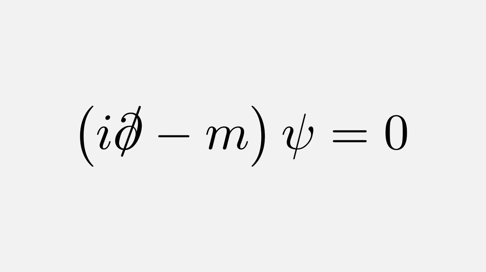

+++
title = "P. vs. D."
slug = "P. vs. D."
authors = ["VV"]
date = 2024-11-25

[taxonomies]
categories = ["umění", "fyzika"]

[extra]
toc = false
+++

### P. vs. D.

"La peinture est plus forte que moi ; elle me fait faire ce qu'elle veut." - P.

"My equation was smarter than me." - D.

*Převzato od KK.*